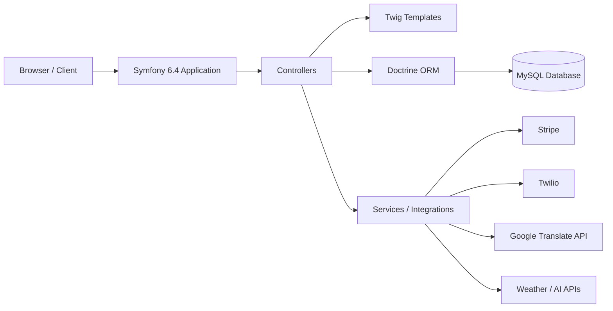

# Sport Insight

Sport Insight is a Symfony 6.4 web application for football club operations.  
It combines training, matches, players, announcements, sponsorship, equipment store, checkout, and admin tools in one project.

## Tech Stack

- PHP 8.2+
- Symfony 6.4
- Doctrine ORM + Doctrine Migrations
- Twig + Bootstrap 5
- MySQL (default in `.env`)
- Integrations used in the project: Stripe, Twilio, Google Translate, Chart.js, VichUploader

## Main Modules

### Front Office
- Home and themed UI (`/`)
- Authentication (`/login`, `/register`, `/sign-up`)
- Training, participation, evaluation, matchmaking
- Matches, teams, players
- Announcements and comments
- Equipment catalog, cart, checkout, orders
- Sponsoring and statistics pages

### Back Office
- Dashboard
- CRUD and management screens for multiple domains:
  - training
  - players
  - evaluations
  - comments
  - announcements
  - sponsoring, sponsors, contracts
  - products and orders
- Admin payment and invitation sections

## Authentication and Roles

Role assignment is currently automatic at registration by email domain:

- `@esprit.tn` -> `ROLE_ADMIN`
- `@coach.com` -> `ROLE_ENTRAINEUR`
- `@player.com` -> `ROLE_JOUEUR`
- any other domain -> `ROLE_USER`

Configured in:
- `src/Controller/SecurityController.php`
- `config/packages/security.yaml`

## Prerequisites

- PHP 8.2 or newer
- Composer
- MySQL server

## Quick Start

1. Install dependencies:

```bash
composer install
```

2. Create local environment file:

```bash
cp .env .env.local
```

3. Update at least:
- `DATABASE_URL`
- `APP_SECRET`

Optional but used by project features:
- `MAILER_DSN`
- `OPENWEATHER_API_KEY`
- `GEMINI_API_KEY`
- `GROQ_API_KEY`
- `FACEPP_API_KEY`, `FACEPP_API_SECRET`
- `STRIPE_SECRET_KEY`

4. Create database and apply migrations:

```bash
php bin/console doctrine:database:create --if-not-exists
php bin/console doctrine:migrations:sync-metadata-storage
php bin/console doctrine:migrations:migrate --no-interaction
```

5. Run the app:

```bash
symfony server:start
```

Or:

```bash
php -S 127.0.0.1:8000 -t public
```

Open: `http://127.0.0.1:8000`

## Useful Commands

```bash
php bin/console cache:clear
php bin/console lint:twig templates
php bin/console doctrine:migrations:status
php bin/phpunit
```

## Project Structure

- `src/Controller/` application controllers
- `src/Controller/FrontOffice/` front office controllers
- `src/Controller/BackOffice/` back office controllers
- `src/Entity/` Doctrine entities
- `src/Form/` Symfony forms
- `templates/front_office/` front office Twig templates
- `templates/back_office/` back office Twig templates
- `migrations/` database migrations

## Troubleshooting

### 1) `The metadata storage is not up to date`

Run:

```bash
php bin/console doctrine:migrations:sync-metadata-storage
```

### 2) SQL errors like `Unknown column ...`

Your DB schema is behind the entity mappings. Run migrations:

```bash
php bin/console doctrine:migrations:migrate --no-interaction
```

### 3) Twig `Unable to find template ...`

This usually happens after merges when controller render paths and template files diverge.  
Check:
- controller render path (in `src/Controller/...`)
- file existence under `templates/...`

## Contributors / Team

| Name | Role | Scope |
| --- | --- | --- |
| Elyes Chaouch | Full-stack development | Front office, back office, database, integrations |
| Amine Bouchnak | Functional design | Club workflows, UX, feature definition |

## Architecture Overview



## License

Proprietary - Sport Insight
